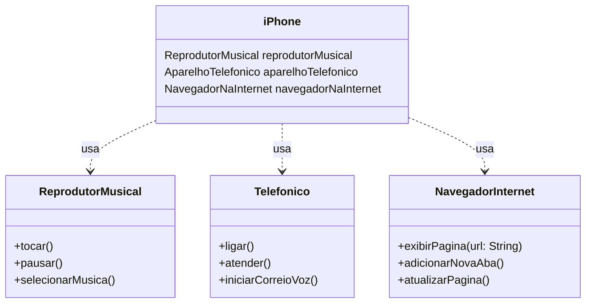

# iPhone Simulator

Este projeto simula um iPhone com funcionalidades básicas de Reprodutor Musical, Telefonia e Navegador de Internet. Foi desenvolvido como um desafio da DIO para modelagem de classes e interfaces utilizando UML e implementação em Java.

## Funcionalidades

| Reprodutor Musical | Telefonia              | Navegador de internet |
|--------------------|------------------------|-----------------------|
| Tocar música       | Ligar                  | Exibir página         |
| Pausar música      | Atender                | Adicionar nova Aba    |
| Selecionar música  | Iniciar correio de voz | Atualizar página      |

## Estrutura do Projeto

1. `ReprodutorMusical.java`: Interface para funções de reprodutor musical.
2. `Telefonico.java`: Interface para funções de aparelho telefônico.
3. `NavegadorInternet.java`: Interface para funções de navegador na internet.
4. `iPhone.java`: Classe que implementa todas as interfaces acima e simula um iPhone.

