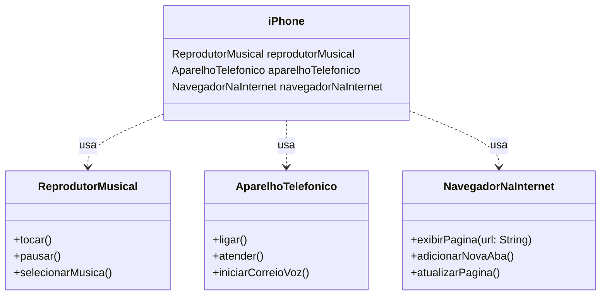

# desafio-UML-iPhone-dio

```mermaid
classDiagram
    class ReprodutorMusical {
        +tocar()
        +pausar()
        +selecionarMusica()
    }

    class AparelhoTelefonico {
        +ligar()
        +atender()
        +iniciarCorreioVoz()
    }

    class NavegadorNaInternet {
        +exibirPagina(url: String)
        +adicionarNovaAba()
        +atualizarPagina()
    }

    class iPhone {
        ReprodutorMusical reprodutorMusical
        AparelhoTelefonico aparelhoTelefonico
        NavegadorNaInternet navegadorNaInternet
    }

    iPhone ..> ReprodutorMusical : usa
    iPhone ..> AparelhoTelefonico : usa
    iPhone ..> NavegadorNaInternet : usa

```
